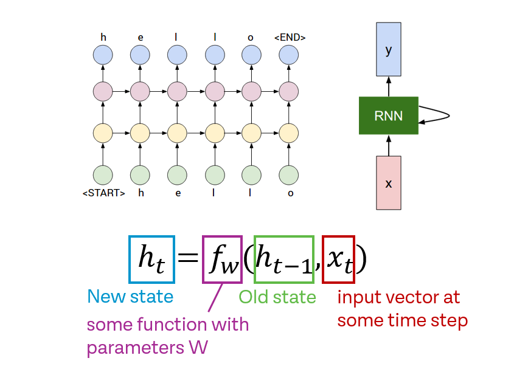

# Char-RNN-OpenCV
Minimal character-level Vanilla RNN model in OpenCV.

## How to Contribute

* Fork the repo on GitHub and send a pull request
* Find a list of TODOs on the GitHub issue tracker

We have not written any unit tests just yet, but we hope to do that soon.

## Author

[Hadi Abdi Khojasteh](http://hadiabdikhojasteh.ir)

## Copyright

Copyright (c) 2017-2018 by Hadi Abdi Khojasteh

## License

MIT
